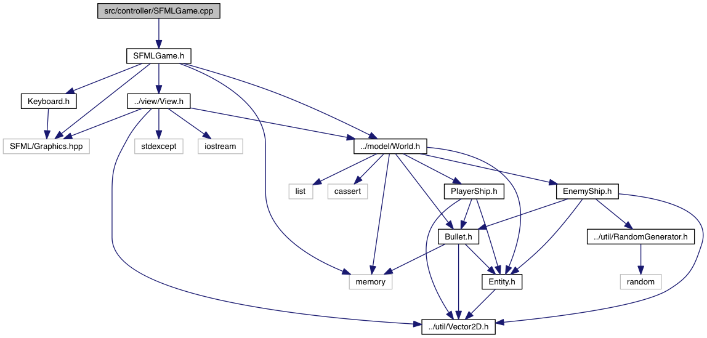
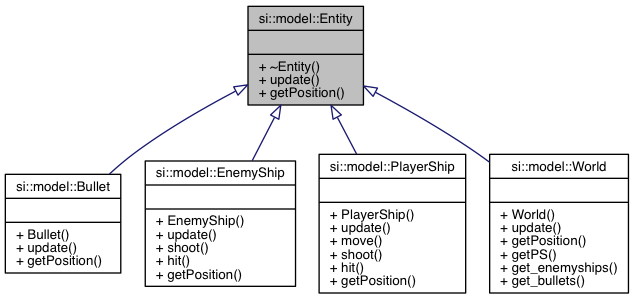

Space Invaders
==============

Brief
-----
This project implements the arcade game Space Invaders in the C++ language with
modern constructs from the c++11 standard.
It hopes to achieve modularity by implementing it in different stand-alone libraries.
For more info on the design reconsiderations see under the Design subsection.

Install
-------
There is an included `run.sh` script which will automatically compile, install
and start the game for you. You can find it in the root directory.
Remember that this will take some time for the compilation phase on the first
run.

./run.sh

Design
------
The Observer pattern of MVC was closely followed in this project.
The controller sets up and runs the game in the main loop in the GameSFML class.
Other classes for other frameworks could be made.

SFMLGame sets up an SFML window on which to run the loop and initiates a model
and a view. It registers the model and the window with the view. The view is
thus an observer which can get data out of the model to draw the model entities
on an SFML window.

The main loop watches for input from the Keyboard helper class and if received
sends an according action to the view.

No SFML related code is found in the model so it can be easy to couple it with
another controller and/or view.

This strict separation of duties can be seen in the dependency graph:

    After the events have been polled it is time to update the entities.
    This is quite easy because the world contains all the entities.
    Though not one big list of all entities. I thought about doing this, but
    decided in the end that advantage of having one big list of entitities
    didn't weigh up against the disadvantages of constantly having to do
    checks for which object the entity actually pointed to which were not solvable
    via polymorphic function calls.

    Though the world still holds all the current entities and the `update` function
    from the ABC entity updates on its part all the enitities the world
    contains. So this is still an application from the Composite design pattern.

    In the UML diagram for Entity and its children you can clearly see the Entity
    and its virtual functions `update` and `getPosition`. `getPosition` is used
    polymorphically in the view to calculate the position for
    Enemyships and Bullets which are stored in containers with Entity pointers.

    I tried to limit memory consumption through extensive use of pointers whenever
    the variables needed accessing across the libraries (model, view & controller
            are all defined in their separate libraries to maximise reusability.). I did
    still take care to not pollute the heap with variables which don't need this
    global access.

    Because a construct to store 2 variables is often needed, for example for a
    Position or Size on a 2D grid, I made a `Vector2D` template which can be reused
    across different types. It can be found in the `util` library together with a
    `RandomGenerator` class
    This Vector2D is then typedef'd with an appropriate type in some classes to
    make it more easily recognizable.

    I also try to only make methods public when they need to actually be publicly
    accessible.

    For more information you can read the extensively documented source or
    use the generated Doxygen documentation by opening `doc/html/index.html` in your
    browser of choice.

    Author
    ------
    Olivier Brewaeys
