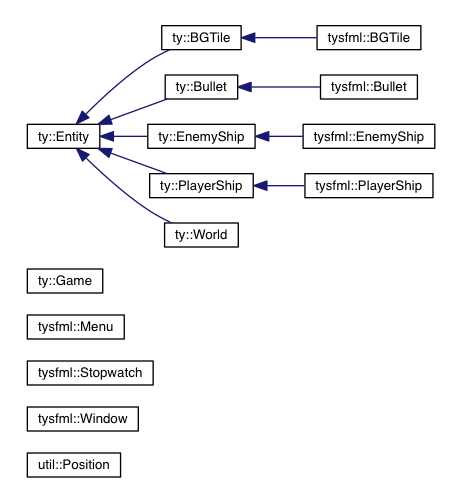

TYRIAN
======

Brief
-----
This project implements the arcade game Tyrian in the C++ language with
modern constructs from the c++11 standard.
It hopes to achieve modularity by implementing it in different stand-alone libraries.
For more info on the design reconsiderations see under the Design subsection.

Install
-------
In Tyrian root directory:

    [rm build]
    mkdir build && cd build
    cmake ..
    make
    make install

You will now have an executable you can run in the bin directory.
You should run it from the Terminal to avoid problems with the binary
locating its resources.

* From `build` dir: `../bin/Tyrian`
* From `bin` dir: `./Tyrian`

Design
------
* Logical separation of the libraries according to MVC-pattern.
    * Model holds the world and the state of the objects.
    * View displays the model: SFML objects derived from their model
      counterparts.
    * Controller controls former components through user-input through the
      keyboard and keeps time with the singleton Stopwatch class.
* Game class is the main controller and also holds the main/game loop.
* Composite design pattern
    * World holds container pointers to entities. Through polymorphism the right
      virtual function is called at runtime.
* Try to limit memory consumption through extensive use of pointers and
  references.
    * Always pass user-defined and STL types by reference if possible.
    * If not possible use smart pointers.
        * Smart pointers -> Effectively eliminate whole family of memory-related bugs
        with no (`unique_ptr`) or minimal (`shared_ptr`) effect on perfomance.
        * Tried to use unique_ptr's where applicable, but `make_unique` is only
        present in C++14 and apparently cmake doesn't support C++14 yet, so
        I couldn't use it for this project.
        I know, it is possible to use `new` instead but I also made the choice
        based on time, as it is just easier to work with a shared_ptr.
        If given more time I could figure out, which pointers only would need
        one owner at a time
* Deque for performant insert and deletes at end of queue
* I couldn't figure out what the use would be for a singleton Keyboard class,
  seeing as the SFML Keyboard keycheck function is a static one.
* Tried as much as possible to use const functions where applicable because
  while it can be a hassle in the beginning, it pays off later when it enforces
      const-correctnes and avoid bugs.
* In view library, textures are loaded through textureloader class when their
  corresponding objects are first made and then popped onto a textures stack
  member, because they have to exist as long as their corresponding sprites
  exist.

Author
------
Olivier Brewaeys (s0114375)
